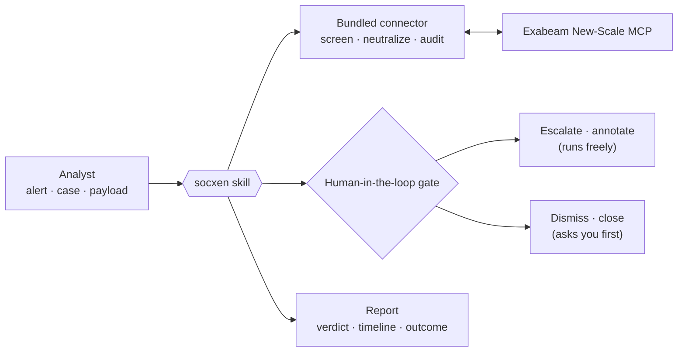

<!--
  Copyright 2026 Exabeam, Inc.
  SPDX-License-Identifier: Apache-2.0
-->

# socxen Documentation

**socxen** is an agentic SOC analyst for **Exabeam New-Scale**, delivered as a plugin for Claude Code and
OpenAI Codex. Hand it an alert or a case and it investigates the way a careful analyst would: gathers the
evidence itself, builds the timeline, reaches a threat / false-positive verdict, and acts — with the
human-in-the-loop gate on dismiss and close **shipped on**, containment **recommended, never executed**, and
every call on an audit trail.

> *Every claim traceable to a call it made. Every irreversible action behind a human's yes.*

*socxen is an open-source project sponsored by [Exabeam](https://www.exabeam.com/), published by the
[Open Agent and AI Security community](https://open-agent-ai-security.github.io/).*

## Where to start

| If you are… | Read this first |
|---|---|
| Installing socxen for the first time | [Installation & setup](installation.md) — the community marketplace on Claude Code or Codex, one credentials file, and what the gate does on each host |
| About to run your first investigation | [Using the skills](usage.md) — what to say, what happens, what socxen asks you before it acts, and how to read the report |
| Wanting to see a real one end to end | [Example investigation](../skills/soc-investigate/reference/examples/coordinated-credential-access.md) — a coordinated credential-access case, from intake to verdict |
| Wondering why a link in a case note looks "broken" | [Security guardrails](security-guardrails.md) — the two always-on defenses against hostile content in your telemetry, and what they do not cover |
| Asked "what did the agent actually do?" | [Audit logging](logging.md) — the on-by-default audit trail: what is recorded, what deliberately is not, where it lives |
| Evaluating socxen's security posture | The red-team ledger, the Praxen scans and the security policy live in the repository: [`security/`](https://github.com/open-agent-ai-security/socxen/tree/main/security) · [`SECURITY.md`](https://github.com/open-agent-ai-security/socxen/blob/main/SECURITY.md) |
| Contributing, or reading the operator-level README | [`CONTRIBUTING.md`](https://github.com/open-agent-ai-security/socxen/blob/main/CONTRIBUTING.md) · [the plugin README](https://github.com/open-agent-ai-security/socxen/blob/main/plugin/README.md) |

## The three skills

| Skill | Ask it | What it does |
|---|---|---|
| **`soc-investigate`** | *"Investigate alert 4821."* · *"Is this a real threat?"* | One alert or case at depth: evidence, timeline, MITRE ATT&CK mapping, verdict, then the non-destructive action — open a case, dismiss an alert, write notes — and a containment recommendation for a human to carry out. |
| **`triage-cases`** | *"What should I look at first?"* · *"Morning triage."* | Sweeps the open queue, clusters cases by attack shape, ranks them by corroborated signal, and returns a short "start here" list plus the noise clusters worth tuning. Read-only. |
| **`rule-tuning`** | *"Which rules waste our time?"* · *"Reduce alert noise."* | Separates loud rules from noisy ones and proposes specific tuning mapped to real Exabeam mechanics — a context table, an exclusion, the rule's own settings. Proposes; never changes a rule. |

## How socxen works (in 90 seconds)

1. **You hand it the work** — an alert ID, a case ID, or a pasted payload — in your Claude Code or Codex session.
2. **It gathers evidence through the Exabeam MCP**, via a bundled connector that screens what comes back, and reasons only over what it retrieved. Content in your telemetry is evidence, never instructions.
3. **It reaches a verdict and acts within the gate.** Escalating and annotating run freely; dismissing an alert or closing a case asks you first, every time; containment is written up for you to perform.
4. **Everything is on the record** — the calls, the gated decision, the guardrail firings — in a local audit trail, on by default.

## The guardrails, in brief

- **The gate ships on.** A dismiss or close always asks the analyst; containment tools are refused outright; any tool the gate has not classified asks rather than runs. It holds even when the host runs with permission prompts switched off.
- **What it reads is screened.** Hidden-character smuggling is stripped from telemetry before the model sees it; the connector's own tool definitions are hashed and screened too.
- **What it writes is de-activated.** Spreadsheet formulas, clickable links and secrets are neutralized in anything socxen persists — case notes, updates, outbound mail.
- **What it did is recorded.** Tool calls, gated decisions and guardrail firings, never case content, in `~/.socxen/telemetry.jsonl`.

Details, and the honest list of what these do not cover: [Security guardrails](security-guardrails.md).

## Quick reference

- Install: `claude plugin marketplace add open-agent-ai-security/plugins` then `claude plugin install socxen@open-agent-ai-security` (Codex: `codex plugin marketplace add …` / `codex plugin add …`)
- Credentials: `~/.exabeam-mcp.env` — the Exabeam MCP URL, API key and secret; see [Installation](installation.md)
- Skills: `soc-investigate` · `triage-cases` · `rule-tuning`
- Audit trail: `~/.socxen/telemetry.jsonl` — see [Audit logging](logging.md)
- Check your setup: `preflight.sh` in the installed plugin — see [Installation § Preflight](installation.md)

For version history see the [CHANGELOG](https://github.com/open-agent-ai-security/socxen/blob/main/CHANGELOG.md); for the release gate behind each version, [`security/redteam/HISTORY.md`](https://github.com/open-agent-ai-security/socxen/blob/main/security/redteam/HISTORY.md).
