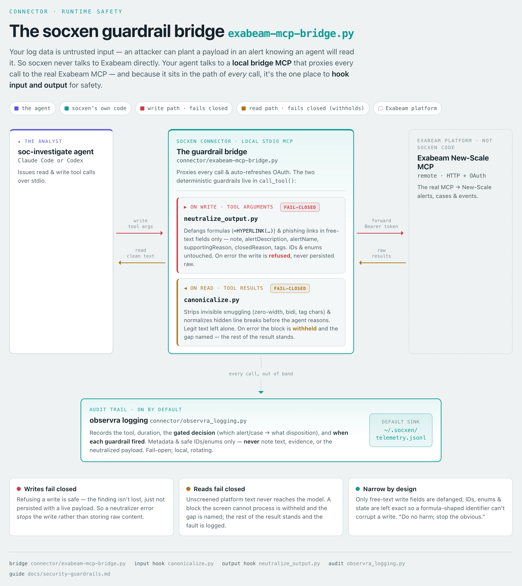

<!--
  Copyright 2026 Exabeam, Inc.
  SPDX-License-Identifier: Apache-2.0
-->

# Security guardrails

**Why this exists:** your log data is not trusted input. Anyone who can get an event into your telemetry
— a phishing sender, a malware sample, a probing attacker — can *plant something in it on purpose*,
knowing an analyst (or an AI agent) will later read it. Think of these as **booby traps left in the log
data**: a hidden instruction smuggled in invisible characters, or a payload that only does damage when a
report is opened or exported. socxen assumes that hostile content is present and screens for it, purely as
a **safety measure** — so a bomb someone planted in an alert can't go off in your hands.

To do that, socxen runs two automatic checks on every Exabeam call. They're always on and need no
configuration.

  <picture>
    <source media="(prefers-color-scheme: dark)" srcset="diagram/guardrails-dark.png">
    
  </picture>

The bridge hooks input and output on the path to the real Exabeam MCP — source &amp; regeneration in <a href="diagram/README.md"><code>diagram/</code></a>.

This is a safety net, not a replacement for judgment. Your **[governance permission gate](installation.md#governance--turn-on-the-safety-gate-do-not-skip-this)**
and your own review before you act remain the primary controls.

## 1. Screening what socxen reads (hidden-character smuggling)

Text can carry **invisible characters** — zero-width spaces, direction-reversing marks, and other hidden
control codes. Attackers use them to *smuggle* instructions past a reader: a line that looks harmless on
screen can hide extra text, or read one way to a human and another way to software.

Before socxen reasons over any alert or case, it strips out the obvious smuggling characters and cleans
up hidden line breaks. What the agent analyzes is the plain, visible text — not a version with hidden
payloads spliced in. Legitimate text (names in any language, file paths, emoji) is left untouched.

## 2. Filtering what socxen writes (de-activating dangerous content)

When socxen writes its findings back to Exabeam — a case note, an alert update — it makes sure it never
*re-arms* a payload that was sitting in the original alert. Two kinds of content are neutralized:

- **Spreadsheet formulas.** A value like `=HYPERLINK(...)` looks like data, but if a report is exported
  to a spreadsheet it can *run* when the file is opened. socxen prefixes these so they're treated as
  plain text and never execute — including a known-dangerous formula quoted *mid-sentence* in a note
  (unlike a plain web address, a pasted formula re-arms the moment it lands in a spreadsheet cell).
- **Clickable links.** Any link written into a note is **escaped** so it can't be clicked or auto-opened
  — you'll see it rendered as `hxxps://example[.]com` instead of a live link.
- **Secrets and personal identifiers.** If a credential (an API key, token, private key, or a labelled
  password) or a structured identifier (a Social Security number, a payment-card number) is sitting in
  the alert data, socxen **masks it before writing** — you'll see `[REDACTED:aws-key]` or `[REDACTED:ssn]`
  in the note instead of the value. The finding is still recorded ("a credential was exposed here"); the
  secret itself doesn't get copied into a case note or export where a wider audience — or an attacker who
  can read case notes — could retrieve it. This is deterministic: it doesn't depend on the model
  remembering to redact. That distinction is measured, not theoretical — in our red-team runs the
  weakest supported model (Sonnet 4.6) reproduced seeded secrets in its raw output in nearly every
  trial, and even the strongest (Opus 5) let a raw credential and an SSN through occasionally. The
  persisted record came out clean **100% of trials on both models** because this filter, not model
  judgment, is what stands between the alert data and the case note.

### Why your links look "broken" — this is intentional

If you see a URL in a socxen note written as `hxxps://sso-reset[.]evil[.]example` rather than a normal
clickable link, **that is the safety measure working, not a bug.** socxen defangs the links it writes so
that a phishing or malware URL buried in an alert can't be clicked by accident — or fire automatically
when someone opens or exports the report later. The address is still fully readable; you can copy it into
a sandbox or threat-intel tool if you need to investigate it. It just can't hurt anyone with a stray
click.

This applies to harmless internal links too, not just suspicious ones. socxen can't reliably tell a
legitimate link from a disguised malicious one, so it treats them the same way — the tiny inconvenience
of copy-pasting a good link is worth never handing an analyst a live malicious one.

## What these guardrails do *not* do

Keep expectations honest:

- They protect the **records socxen writes** and the **text socxen analyzes**. They do not sanitize
  content you open directly in the Exabeam console or elsewhere — treat raw alert data with normal care.
  In particular, the redaction above protects what socxen **persists** (case notes, exports) — the
  durable, wider-audience copy. A secret shown on **your own screen** during an investigation is *not*
  redacted, and that's deliberate: you're already authorised to read the underlying log, so it crosses
  no trust boundary the console itself doesn't.
- **Large results are written to a local file, and it isn't redacted.** When the Exabeam MCP returns a
  payload too big for the context window — a full case dump, the rule inventory — the harness writes it
  to a file under `~/.claude/projects/…/tool-results/` so socxen can extract the few fields it needs.
  That file holds raw telemetry and is *not* run through the redactor. It crosses **no trust boundary the
  console doesn't** — it lives on the same machine you're signed in to New-Scale from, where you're
  already authorised to read that data — but unlike scratch it **persists after the session and is not
  pruned automatically.** socxen itself neither writes nor transmits it (the harness does), but the raw
  copy is durable: **if the case data is sensitive, delete those files when you're done.**
- Redaction covers **structured** secrets and identifiers (keys, tokens, SSNs, card numbers) — the shapes
  a deterministic pass can catch without mangling legitimate reports. It does **not** chase free-form
  personal data such as **names or home addresses**, or **dates of birth** (a date is indistinguishable
  from the timestamps in every log line). Handle those with the same care you'd give any sensitive case.
- A credential written as a **plain dictionary word directly after a line break**, with no label, no
  quotes and no table structure around it, is not masked — after a line break such a value is
  indistinguishable from the recommendation prose that normally follows ("credential — Rotation is
  required immediately"), and redacting it would eat real analyst text. Labelled, quoted, backticked and
  table-cell credentials are all masked regardless of their shape.
- A **bare, unstructured credential** — a password with no recognizable format, written into the report
  with no nearby label like "password:" — is caught on a best-effort basis, not guaranteed: with nothing
  to grip (no format, no label), a deterministic pass can miss it. Labelled and structured credentials
  are reliably masked; a value that is *only* a secret because of where it sat is the edge case. Treat a
  known-exposed password as compromised regardless of what the note shows.
- A suspicious link typed as ordinary prose in an alert may be left as written; the link-escaping applies
  to links socxen itself writes into notes. Always verify a URL out-of-band before you trust it.
- Link escaping covers the ordinary link form. Unusual variants — a link carrying a title, one padded
  with spaces inside its brackets, a reference-style definition, or a raw HTML anchor — are **not**
  escaped and will render as live links. Treat any link in a note as unverified regardless of how it
  is rendered.
- They reduce the blast radius of hostile content. They do **not** replace the permission gate, your SOC
  procedures, or your judgment on the verdict itself.
